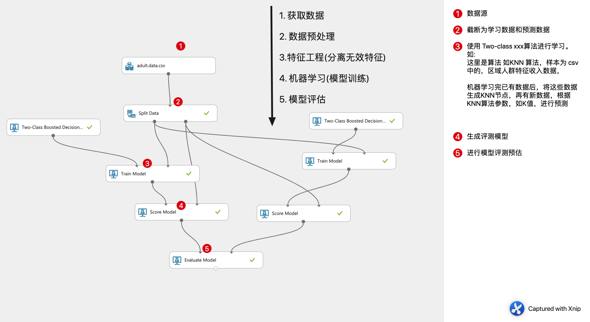

## 1. 学习人工智能需要开启记忆模式！

*Any knowledge point is not missed*


## 2. 开发步骤 & 公式工作过程


*获处特机模*


### 2.1 数学公式工作过程


*拿算法采用knn, 分类问题预测，roc曲线来说*


1. knn 选取好k值，融入样本(带有是否是男女的标签)后
2. 放入测试集，假设一个数据进入
3. knn 算法通过k个相邻的值来分析新的数据距离最近的点，判断它为这个类别
4. 操作准确性,也就是衡量Knn算法好坏采用测试集得出的  roc 曲线
5. roc 曲线在测试集上表现优秀，便可以拿来预测新的数据啦


## 3. 距离度量

大公司足够了，同类型书籍比的话

欧曼(城市街区距离)切汉马，标闵杰， 巴氏系数


## 4. Workflow


1. 机器学习流程

   


## 5. Tip

1. 线性模型，kx… x 是一次方的时候，非一次的时候变为曲线

2. KNN

   - (K临近算法)是用来解决高纬度问题，实现降纬， k 值越大 容易 **低拟合**, 小容易 **过拟合**

   - 缺点:

     - 

3. K树检索

   - TODO 画圆那里

4. 拟合

   - 过拟合特点: 训练样本准，测试集不准

   - 欠拟合特点: 训练，测试集都不准

5. 维灾难: 欠拟合 -> 过拟合

   1. 信息增益越大，则这个条件的影响越大

6. 维度：数据特征(csv数据文件, lable), 样本: 数据

7. 二维叫平面，超过三维叫超平面

8. 每增加一个特征便增加一维

9. 评价模型在训练集和测试集的表现 "拟合"

10. 维灾难，随着维度地增加分类器的性能逐渐上升，达到某点后维度开始降低

11. 决策树之熵，熵越低越密集

12. 箱形图（Bot-plot）,盒须图, 显示数据分散情况的图

    


## 6. Keywords

```
sklearn  
```


## 7. Photo & 公式


### 7.1 熵（用H表示）值计算


###7.2


## 8. Mathematics


1. 正态分布： 又叫高斯分布，两边低，中间高： 未完

2. 常用符号 B, E(求和)，ln, log， (自查补全)

3. 方差，标准差

   ```
   方差是各个数据分别与其平均数之差的平方的和的平均数(方差（Variance）用来度量随机变量和其数学期望（即均值）之间的偏离程度)
   
   标准差是方差的算术平方根。σ表示
   
   
   ```

4. 数学符号学习

   ```
   f([x1, x2, x3, x4..]) = Y # f 表示经过funtion对x1..x4特征的运算，得出某个(ppt回归)值	
   ```


4. Ln, 与 le

   以2为底，记作lb， 单位bit
   以e为底，记作ln， 单位nat

5. 线性函数

   

   

   y=ax函数(a为常数且以a>0，a≠1)叫做指数函数

   

   

   

   6. 方差，标准差为方差的算术平方根

      ​	如果只是要描述样本数据间的[离散程度](https://www.baidu.com/s?wd=%E7%A6%BB%E6%95%A3%E7%A8%8B%E5%BA%A6&tn=SE_PcZhidaonwhc_ngpagmjz&rsv_dl=gh_pc_zhidao)，则样本方差计算公式中的除数应为"n”。

      

   

   7. 符号
      1. var X的方差,记为D(X),Var(X)或DX 

      2. 大写的Δ是用来表示变化量的符号。 而小写*δ*通常在高等数学中用于表示变量或者   符号

      3. yˊ y 的一阶导数(函数中某一点的切线的斜率)

         极值为 导数 = 0 的时候的值

         ```
         对于函数的导数的几何意义 就是这个函数图象的斜率的函数.
         再简单点，比如求某点的导数.就是求这点的斜率.
         比如y=x 这个函数的导数就是y=1
         即y=x 这个函数的图象上的任意一点的斜率都是1
         比如y=x² 这个函数的导数就是y=2x
         即y=x² 这个函数的图象上的在x=a的斜率为 2a (比如x=1,那么y=x² 在x=1处的斜率为2，
         x=2,那么y=x² 在x=2处的斜率为4)....
         
         一个z对应一个x和一个y，那就有两个导数了，一个是z对x的导数，一个是z对y的导数,称之为偏导。
         ```

         

      

      <https://blog.csdn.net/weixin_42137700/article/details/81449372>

   

   8

   

## 9. ISSUE

1. AUC 由来

   如下矩阵便是混淆矩阵

   


​	ROC 曲线 受试者工作特征*曲线*，便是由诸多样本数据变化上图1线，生成多个混淆矩阵计算TPR 和 FPR ，生成, x, y 坐标，所画出的曲线

​	


1. 回归率，f系数的作用, B 发音

   ```
   # 有时候我们对精确率和召回率并不是一视同仁，引入一个你参数 来度量二者关系，B > 1 召回率更有影响，B=1 时，影响一致(F1) ，含有度量参数 B 的 F1 记为 FB
   ```

   

   ​		


3. 标签与特征

   *当没有标签的时候，则可以把相似的数据归为一类，再根据分类定点推广，或异常检测(消费分析，突然大笔消费等)，这是聚类算法*

   


4. 复杂度 阶指幂对

5. K树的检索(阿里面试如何实现很多维度下的快速检索)

   ```
   knn 算法指定k值后，使用 k树的检索，查找这 k 个点，可以降低高纬度，在以x(x1, x2), x1 找到节点后，需要回溯到根节点(判断是否与线有相交，如有说明可能有更近的点，因为 x2 变量的缘故，这也是回溯的原因)
   ```


   


6. 决策树熵画图

   *左侧，只是赋予等值，右边为熵的计算公式。右侧正态分布图，当概率值p值为0，和 1 时，熵为0/1因为确定发生*

   


7. K-means 算法中间过程质心变化没理解


8 区别还是不很清楚，CH SC系数


9 公式含义


10. 线性回归，损失函数，求 w, b, 其实就是找到让这个损失函数最小的 w 和 b 的值

## 10. Others


## TODO


1. 算法图解
2. [中国平安](https://www.zybuluo.com/rianusr/note/1315377)  [中国平安](https://www.jianshu.com/u/16236007e0b0?utm_campaign=hugo&utm_medium=reader_share&utm_content=user&utm_source=weixin-friends)
3. 机器学习周志华，机器学习李航(每日读，纸质书购买)
4. 面经当做交流，以及day1作业
5. 像无数枝叶的知识点，进行xmind画图，是不适合完全展开的
6. 对问题的本质还是每个人建立一套自己的理解比较好
7. 不管怎么说，自己都要给自己一个结果
8. 既然是最后那就认真走完
9. 学习算法步骤
   - 算法，时间&空间复杂度，优点，缺点，公式，算出来的值大小是好还是坏, 函数中的应用，再加 xmind， 再加具体实例自己的一个计算。
10. 可以考虑找数学的视频看看，其实并不需要太多的知识，以课堂上为核心体系，主键铺开即可