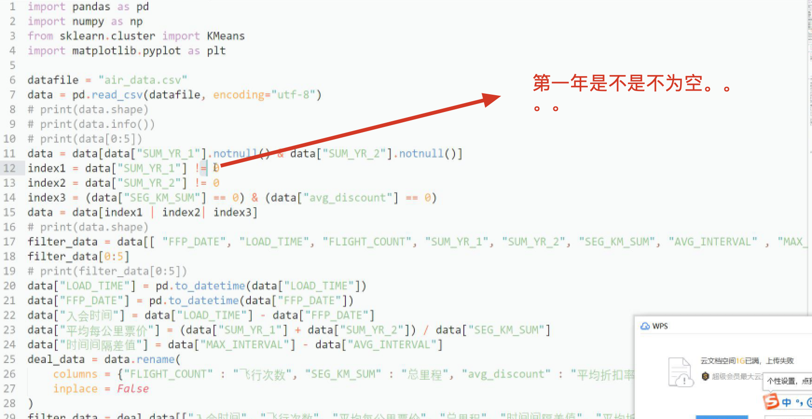

## 总复习 到 9:32


### 疑问点


机器学习： 从历史数据中分析获取模型，预测未来数据


获取数据时，测试集是男生，训练集不要是女生


聚类模型: K-means, 安层的(层级聚类)， 密度聚类(半径，和最小点数参数)


回归指标


分类指标：ra(上两项，下四项)p, 


b >1 召回度影响大，根据需求定的


控制里有三个大问题，有一个就是 维灾难，就是我们不能考虑太多因素，有的没有代表性


为什么纬度高了 分类不好分了：密度越来越少，相当于样本越来越少，样本距离越来越远，就没法通过相似性度量来确定彼此之间的关系。


今天找工作，分析，如果 写20 - 30K， 你就要 24/5, 公司招聘符合自己要求，所以找工作一定要看工作薪酬，别写了 20 你说 13就可以了，如果有某个公司你很想进， 你要按照它的要求投一份简历，拿到一家后，就说已经有一家 +2K 的了， Hr 会在给你 发 offer 后衡量，来不来，来了后多久离职，霍尼韦尔(美国外企)， 超过离职率后，扣钱，hr 为了留他，给他老婆办了一家工作，老婆做移民监


Knn 能想到什么问题


```
k 值怎么选，肘部法也可以(变相的)， 不要 大于 样本数的平方根，一般情况下不要取偶数，3个的话就别去奇树


k 值选择， kd 树


k 值过小，过拟合，过大欠拟合


knn 算法流程

计算距离，投票，返回 

knn 之前处理 糖尿病，即使选了 最好的两个特征 KBEST 效果不好,所以要选好算法

knn 惰性学习，没有构建出任何学习的模型，所以惰性

用kd树可以将 复杂度 从指数复杂度 降为 xxx 10:01 

kd 树一定要回溯到根节点，不相交也要回溯

问： 我现在有多个维度数据怎么检索 , 三个点平均值???  @ 10:03


超参数 人为设置的， knn k, 学习率，密度聚类的 半径，点数


```


距离


```
边距 汉明，集合: 杰卡德， 不同群体的： 马氏距离，闵式距离  xx = 2 为欧式距离，
```


决策树


```
熵的公式：

负 概率*概率的对数

概率为0和1的时候，熵都是 0, 因为确定


信息增益 = 熵前 - 熵后 (增加信息后熵变化？)

信息增益率，信息增益 * 数目 / 样本总数

skearn 默认用的 基尼，但是感觉不大到

决策树 做回归，通过平均值

为什么要减枝： 
防止过拟合，还有就是不像 KNN 我们没有设置 k值，我们控制的变量很少

如何设置： 深度，最小样本数，基尼或者熵低于 某个值的时候，让它不分裂

弊端:
数据变化,决策树变化大

c4.5 对于 id3 的优点在于 增加了比重? @10:14

熵的话混乱程度高


```


聚类

```
1 确定质心点数 2 把点归到质心类别上 3取质心和点的平均值，建立虚拟质心，

数学 xx 算法证明了  @10:17

聚类评估:
SSE 误差平方和
本簇内样本到它的质心，的距离的平方和，期望
```


```
质心选取对结果影响还是很大的 , Ci 第几簇

除了误差平方和之外，k 值越大越小， =n 时误差为0，因为每个点都是一个质点，
第一次选 拐点，拐点右边 类别太多，你希望用尽量少的 K 值来取尽量多的样本

SC(轮廓系数法) 系数  S 属于 -1 到 1 之前，越趋近与 1 越好

CH 系数， 越大越好，值域可以很大，考虑到了 考虑到了 m 和 K， 同时衡量了 m k, sc 不是越大越好吗

案例写下 

```

方差大的第一个簇 点散 


```
折线图，plot, 散点图，scatter 


分批处理 快  > 批量处理，


Sklearn  机器学习用的包

Kmeans 整个实践包都收到了，上边和 kmeans 之间的关系


```


```
算法复杂度 (i*k*n) 
```


```
聚类算法，得到不一定是最优点，k中心点个数 ? 初始点  @ 10:47 
缺点?

优化算法： Canopy , 什么时候停息下来? 对噪声明显

二分 kmeans , 所有的点都在一个簇内，一分二，选出误差平方和最大的簇，再进行拆分，(因为这个聚类的效果差，如之前的分班)，不受初始值的影响，因为不需要求初始值，每次都保证误差最小，把误差大的拆了

k-medioids 

ISODATA 特点: 类别会动态变化, 

mini batch K-means(适合大数据的聚类算法，)

当数据量比较大的时候用 xx 和 批量梯度下降一样 ？？ @1056

Kernel K-means kernel 不是 kmenas 独有的，xx也不是


DBSCAN(基于密度的聚类)， 不管怎么聚，都是走向密度大的那个地方，
半径过大发现不了特殊形状，点的数量不同也会有不同结果，对噪声好，仅次于 kmeans  空间复杂度，时间复杂度?

大多数人只知道  kmeans 因为书上只讲了 kmeans，而不知道密度聚类，层次聚类


层次聚类，开始每个样本作为一个簇，求距离合并，

好处: 聚为一类的时候停止，一层成型，直观 截图??

Mean-shift

通过颜色和位置写出一个密度函数，找到一个最匹配的地方


Mean shift 还是对 Kmeans 的优化吗


以上都是  kmeans 的优化？还是平级选取，有的是新的 聚类

网上查不出？
```


线性回归

做什么的??  最小二乘法讲了吗？？

```
判断好坏， 还是回归的判断

线性回归求解是?

最小二乘法， 不常用了，梯度下降代替了，因为
```


```
梯度下降法

学习率 + 原函数的导数， 损失函数为 凸函数的时候能求得最小值点，如下图，
可以解一维多维变量 @11:34 

一般学习率设置过大，容易找不到最低点，学习率过小收敛比较慢，所以找到一个差不多的学习率即可

当 西塔不变的时候 认为到最好 @11:36

mini batch 批量梯度下降(选一批点) 随机梯度下降(直选一一个点)  梯度下降最慢

梯度下降使用场景：深度学习会用到

为什么在梯度下降中使用 归一化: 不归一化两边更新速度不同，一个圈从不同方位到中心点距离


有时候停留在山坡上，所以我们 有时候 给一个随机梯度下降让它跳出去，如果跳出去更好就沿着走下去，不然就当之前更好

批量下降超参数: 学习率，还有其他的一些线性回归参数


```


多项式回归


```
为什么 出现 三次方项， 还是线性，因为 求 西塔 x^2 是系数可以当做定值

多项式回归，容易过拟合，因为维度会复杂些 @11:42

误差三部分： 偏差(欠拟合) 方差(过拟合) 不可避免的误差(噪点，异常值)
```


```
十折交叉验证，取每一段算完后相加，取均值, 
```


正则化


```
l1 套索， l2 岭回归  弹性网络  @ 11：42 - 11：47
 正则项 加在训练集 
l1 l2 区别
l2 减少系数大小，l1 不想关的设置为 0
弹性网络 配比  

如下图曲线波动大，正则化 程度低 @11：47 图？？ 


```


逻辑回归>


```
逻辑回归和线性回归区别

逻辑回归做分类的，线性回归做回归的

概率？ 线性回归就是在逻辑回归 前套了一个 xx 函数(梯度下降)， 范围变到了 0-1? 草不录屏

11 - 49 - 11：53 没听   11：53： 12：10 完全xx

只是里边具体参数有变化


第一步都差不多 

```


Softmax 函数


```
输出的是不同类别的概率，一般情况下取的是最高的

逻辑回归的正则化，

对于逻辑回归 不能做亦或的问题，

逻辑回归变多了 变为深度学习????? @12:10 11

```


贝叶斯


```
估计一件事情的时候，有新信息出现的时候，概率不同了，

为什么要加 拉普拉丝平滑，防止低概率为 0

小蓝色车问题，为什么反应不过来 是不是可以 练习一下???

@12：15 自己算下 - @12：17

抗干扰，但是 选预值不好选， 数据需要统计(excel统计)， 数据准备阶段唯一需要人工的

数据集太小容易出现偏差，所以  sktlearn 里引入了额朴素贝叶斯...等

贝叶斯导入的是 高斯 高斯贝叶斯分布  @12:20

模型其实有两种，生成模型(把山羊绵阳，都预测，生成了很多模型)，判别模型(预测出来是什么就是是什么，预测的概率， 如决策树，出来哪一类就是哪一类)


```


贝叶斯用的是典型的生成模型，有亲戚关系算一个，没亲戚关系算一个

```
生成模型判别模型区别

- 生成模型数量
- 生成模型占用资源率大，收敛快，预测快，
- 类别判断一般使用 判决


隐变量：马尔科夫问题里的，如扔硬币(特制作的，正反面概率，不同，扔了三次结果，但不确定是一个硬币扔了三次还是三个扔的，)，生成的代表典型的就是 贝叶斯，有多少个 我给你计算多少个，

半朴素贝叶斯， 外贸和属性是独立的，如清华和外贸，属性和属性之间可能没有关系，朴素贝叶斯 怎么了 @12:31    
```


## 发音


| **σ** | **sigma** |
| ----- | --------- |
|       |           |

| **∑** | **σ** | **sigma** | **sigma** | **西格马** |
| ----- | ----- | --------- | --------- | ---------- |
|       |       |           |           |            |

| **Α** | **α** | **alpha** | **alfa** | **阿耳法** |
| ----- | ----- | --------- | -------- | ---------- |
| **Β** | **β** | **beta**  | **beta** | **贝塔**   |


## 下午


1. 讲一个 特征工程和 竞赛的


## 特征工程


特征越好，算法灵活性越好，模型简单些， 数据的完整性和干净性，防止垃圾进，垃圾出，特征工程做好了，即使参数不是最优的，模型性能也不错


数据降维和特征选择，一个是维度降低，二是去掉特征，最终特征都是减少，因为维度本身就是特征


过拟合有时候也可以加入正则化 减少拟合


卡方检验和箱线图 一起讲的??? @再复习下这块


离散化


绝对值标准化，除以最大值 的 绝对值 结果就会再  -1 - 1 之间


二值化: 


降维的:


苹果非立体，平面也可以看出是一个苹果，这只是一个例子


噪声点(0- -5岁)，离群点(95岁只有一个，太少了)


维归约，将维：

1. 数据压缩处理， 数量归约


降维带来的影响: 俄罗斯没有你想的那么大(3d-2d失真，三维到二维导致的)


1. 降维的方式: LDA, 

​	投影后类与类之间的方差小，类与类之间的大些


2. PCA 主成分分析法

​	找出数据集里最主要的方面，用数据的主要方面来代替原始数据


3. 流形学习  使用的是 欧式距离的局部有效性

   使用测地距离，贴着表面走的最短路径，曼哈顿是 只能走直角

   测地距离，使用的是 欧式距离的局部有效性	

   

   

   

   


## 决定求生的项目


这个是 38 是什么


不需要取所有的，吃鸡这里取了100万条。

这里 不断正则化 维度 从 37 - 了 53 ???  @436

其实代码很少，每个人跑的准确率不同，不设随机状态的区别??

## TIO


宗成庆的书，国内最权威的xx的，数学基础

SVM ，到时候会录成视频


## TODO > 都有视频

周志华的书现在看应该比较简单了?

数据预处理 上个案例，航空系统那儿




1. 9:36 昨天看的是哪个 - 9：39 分类回归

2. 9：59 两个之和  - @10:00 
3. 问： 我现在有多个维度数据怎么检索 , 三个点平均值???  @ 10:03
4. 10：06 所以。。。？？ 拟合成不同树????

5. 10：07 ！！！！！-  10:09 !!!! 

   ```
   9000 个人难道要分9000个类别吗，什么意思
   ```

6. @12:12 决策树 弊端， 特征做的多吗

7. 数学 xx 算法证明了  @10:17 - @10：19  SSE 算法s

8. @1033 - @1039  ！！！SC 系数重听

9. @10 47 - 10-50!!  对噪声明显那部分? 到 kmans ++, 二分 kmeans

10. @10: 50 - @10:55 k-medoids 是什么? isodata? mini batch 走神

11. 当数据量比较大的时候用 xx 和 批量梯度下降一样 ？？kernel 还在xx用 梯度下降 和 逻辑回归 @1056 - 10：57 

12. DBSCAN 基于密度的聚类  @10:58

13. 11：00 边界上的点在圆的周长上，基于密度的聚类，

14. @11：04  层级聚类，可以用平均，最小, 质心距离?? 05 max? 06有一句走神

15. 11：19 最小二乘法几何意义

16. 当 西塔不变的时候 认为到最好 @11:36

17. @11:38 不是所有函数都能找到最低点

18.  @ 11：42 - 11：47 正则化

19. 上课发的案例 10点 实践1  + 贝叶斯.zip

    


20. @312 离散化 

21. @322 数据立方体 看完整  @324 - @325 s异常值的聚类清洗和填补！@332 垂线 - 335

22. @354 对比 pca 和 流形，以及案例  - @347

23. @415 @418 少了一条  

24. @418 - @423！！  @426 那个 37 是什么意思 应该是维度，如果是 初始维度 也是 37 

25. 绝地求生项目可以检测是否开挂

26. @435 加过正则的热度编码的?   

27. @437 - @441!!

28. kaggle  & 天池大数据(提交一个当时，就有排名)，

29. 有个朋友天池，3-4个人，复试又忘了

30. 深度学习中文比较少

31. 天池 10个 8个可以去面试的

    


# 一般做这么一个项目要多久，在公司做什么????


## ISSUE


1. 绝地求生是一个 回归问题?   

```
你必须创建一个模型，根据他们的最终统计数据预测玩家的排名，从1（第一名）到0（最后一名）。

```


2. 算法竞赛优先

   


## 代码很少看想法能不能想到。


## 有了吃鸡和糖尿病项目，最好加一个天池，不要说xx自学。。


# 上午实践  那个 kmeans 案例 @3: 52 

# 简历时加 做过 kaggle 竞赛的项目


# 阿里 天池挑战赛(一直提交你的，参加入门赛)，AI 挑战赛 AI CHALLENGE(深度学习也可以做就要用 GPU)


#数据预处理案例，这个东西每次都这个流程，所以记住，案例都一样，做图片，压缩，贝叶斯，


## 看过什么书，机器学习与模式识别，数据之美，以及论文，吴军数学之美，浪潮之巅


## 之前的前期视频都会给到。有问题再联系


